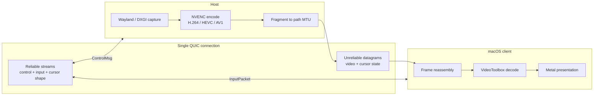

# streamd


**Low-latency remote desktop over QUIC with NVENC encode, VideoToolbox decode, and zero-copy Metal presentation.**

streamd is a self-hosted remote desktop stack for a focused path:

* Linux Wayland or Windows on the host
* macOS on the client
* one outbound QUIC connection
* hardware video on both ends

## Why It Exists

Most remote desktop tools force at least one compromise you can feel:

* TCP-era head-of-line blocking
* relay-first WAN assumptions
* opaque protocol decisions
* a codebase that is hard to reason about when something goes wrong

streamd is built around the opposite trade-offs:

* **Video on QUIC datagrams** so a lost packet drops a frame, not the whole stream
* **Hardware everywhere** with NVENC on the host and VideoToolbox + Metal on the Mac
* **Single-port WAN setup** with one UDP forward on the server side
* **Open Rust codebase** where transport, protocol, capture, encode, and decode are inspectable
* **Layout-independent input** using USB HID usage codes instead of layout-specific key symbols

## Status

streamd is in **alpha**: the fast path is implemented, packaged releases are automated, and CI covers the supported build surfaces. The main remaining caution is security hardening, not transport capability.

| Platform | Role | Status | Release Artifacts |
|---|---|---|---|
| Linux / Wayland / NVIDIA | Host | Primary path | `x86_64-unknown-linux-gnu` |
| Windows / NVIDIA | Host | Secondary path | `x86_64-pc-windows-msvc` |
| macOS | Client | Primary path | `x86_64-apple-darwin`, `aarch64-apple-darwin` |

## Download And Install

Prebuilt archives, checksums, SBOMs, and install scripts are published on the [GitHub Releases page](https://github.com/puukis/streamd/releases).

The release pipeline produces:

* `streamd-server-x86_64-unknown-linux-gnu.tar.xz`
* `streamd-server-x86_64-pc-windows-msvc.zip`
* `streamd-client-x86_64-apple-darwin.tar.xz`
* `streamd-client-aarch64-apple-darwin.tar.xz`
* installer scripts such as `streamd-server-installer.sh`, `streamd-server-installer.ps1`, and `streamd-client-installer.sh`

The release lane is tag-driven:

```bash
git tag v0.1.0-alpha.1
git push origin v0.1.0-alpha.1
```

Every `v*` tag runs the generated release workflow and publishes platform-specific artifacts for the host and client binaries.

## Build From Source

### Host

```bash
cargo build --release -p streamd-server
```

### Client

```bash
cargo build --release -p streamd-client
```

Both binaries support `--help` and `--version`:

```bash
streamd-server --help
streamd-client --help
```

## Quick Start

### 1. Start the host

```bash
RUST_LOG=info cargo run --release -p streamd-server -- 0.0.0.0:9000
```

### 2. List displays from the Mac

```bash
cargo run --release -p streamd-client -- 192.168.1.50:9000 --list-displays
```

Example output:

```text
[0] wayland:67 HDMI-A-2 1920x1080 (ASUSTek COMPUTER INC VG279Q3A)
[1] wayland:68 DP-3 3840x2160 (Samsung Odyssey G80SD)
```

### 3. Connect

```bash
cargo run --release -p streamd-client -- 192.168.1.50:9000 --display 1
```

Grant **Accessibility** and **Input Monitoring** permissions when macOS prompts.

## Requirements

### Linux host

* Rust toolchain
* `clang` / `libclang` for bindgen
* NVIDIA GPU with NVENC support
* NVIDIA driver exposing `libcuda.so` and `libnvidia-encode.so`
* Wayland compositor with `ext-image-copy-capture-v1` and `ext-output-image-capture-source-manager-v1`
* `/dev/uinput` write access
* DRM render node access (`/dev/dri/renderD*`)

Useful preflight checks:

```bash
nvidia-smi
ls -l /dev/uinput /dev/dri/renderD*
printf 'WAYLAND_DISPLAY=%s\nXDG_SESSION_TYPE=%s\n' "$WAYLAND_DISPLAY" "$XDG_SESSION_TYPE"
```

### Windows host

* Rust toolchain
* NVIDIA GPU with NVENC support
* Recent Windows build with DXGI Desktop Duplication available

### macOS client

* Rust toolchain + Xcode Command Line Tools
* Apple Silicon or Intel Mac with VideoToolbox and Metal support
* Accessibility permission
* Input Monitoring permission

## WAN Setup

All traffic runs over the client-initiated QUIC connection. For direct internet access you only need one router change.

| Field | Value |
|---|---|
| Protocol | UDP |
| External port | `9000` |
| Internal IP | server LAN IP, for example `192.168.1.50` |
| Internal port | `9000` |

Then connect with your public IP or a DDNS hostname:

```bash
cargo run --release -p streamd-client -- myhome.example.net:9000 --display 0
```

## Architecture



### Transport channels

| Channel | Direction | Mechanism |
|---|---|---|
| Control | bidirectional | QUIC reliable stream |
| Input | client → host | QUIC unidirectional stream |
| Video fragments | host → client | QUIC unreliable datagrams |
| Cursor state | host → client | QUIC unreliable datagrams |
| Cursor shape | host → client | QUIC reliable stream |

### Video path

* Linux capture prefers DMA-BUF + GBM and falls back to SHM
* Windows capture uses DXGI Desktop Duplication
* NVENC runs with `sliceMode=3` so slices can be sent before the full frame is complete
* The client reassembles fragments by `(frame_seq, slice_idx, frag_idx)`
* Sustained loss triggers `RequestIdr` so the session can recover without reconnecting
* VideoToolbox decode feeds a zero-copy Metal presentation path on macOS

### Input path

* Keyboard and mouse are serialized as `InputPacket`
* Keys are represented as USB HID usage codes to avoid layout mismatch issues
* Linux injects via `/dev/uinput`
* Windows injects via `SendInput`
* Local capture toggle is **Ctrl+Option+M**

## Release Engineering

The repo now has a real release lane:

* GitHub Actions CI across Linux host, Windows host, and macOS client builds
* `cargo-dist` generated release automation for tagged builds
* SHA-256 checksums for archives
* CycloneDX SBOM generation
* GitHub artifact attestations
* auto-generated GitHub release notes grouped by labels
* Dependabot updates for Rust dependencies and GitHub Actions

If you change packaging config, run:

```bash
dist generate
dist plan
```

## Security Model

Current transport security is intentionally minimal:

* the connection uses self-signed certificates
* there is no CA-backed trust chain
* the project assumes you control the network boundary

If you expose streamd over the internet, **restrict it at the firewall** and treat it as an alpha service until the authentication story is hardened.

See [SECURITY.md](SECURITY.md) for reporting guidance.

## Telemetry

The host emits `Heartbeat(ServerTelemetry)` once per second. Useful fields include:

| Field | Meaning |
|---|---|
| `avg_capture_wait_us` | time waiting for the compositor frame |
| `avg_capture_convert_us` | frame preparation time before NVENC |
| `avg_encode_us` | encode time per frame |
| `avg_send_us` | fragmentation + QUIC send time |
| `avg_pipeline_us` | total capture-to-send latency |
| `idr_count` | keyframe count over the last second |

## Troubleshooting

**`NVENC headers were not found`**  
The repo expects the vendored header at `third_party/nv-codec-headers/include/ffnvcodec/nvEncodeAPI.h`. Use `NVENC_HEADER_PATH` or `NVENC_INCLUDE_DIR` to override it.

**`open /dev/uinput` failed**  
Add your user to the `input` group or install a udev rule that grants write access to `/dev/uinput`.

**Wayland display enumeration fails**  
Verify `XDG_SESSION_TYPE=wayland` and confirm your compositor exposes the required capture protocols.

**Video is choppy over WAN**  
Check the UDP forward on the server router and confirm the client network is not filtering outbound UDP.

**`version mismatch` on connect**  
Build the host and client from the same source tree or use binaries from the same GitHub release tag.

## Community

* Usage questions and setup help: [GitHub Discussions](https://github.com/puukis/streamd/discussions)
* Bug reports and feature requests: [GitHub Issues](https://github.com/puukis/streamd/issues)
* Contribution guide: [CONTRIBUTING.md](CONTRIBUTING.md)
* Support routing: [SUPPORT.md](SUPPORT.md)

## License

MIT. See [LICENSE](LICENSE).
