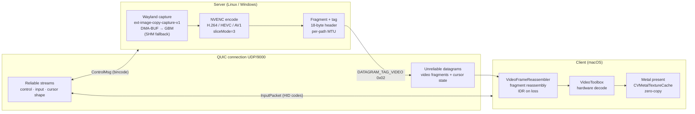

# streamd


**Remote desktop over QUIC with subframe latency, hardware encode, hardware decode, and zero copy presentation.**

* **No head of line blocking**: video travels as QUIC unreliable datagrams; a lost packet drops one frame, not the stream
* **Hardware everywhere**: NVIDIA NVENC encode on the server, VideoToolbox decode + Metal zero copy present on the Mac
* **Single UDP port, no relay**: the client opens one outbound QUIC connection; WAN works with one port forward, no VPN
* **Multiple codec negotiation**: H.264, HEVC, or AV1; client sends a preference list, server picks the best it supports
* **HID based input**: keyboard events use USB HID usage codes so layout differences between Mac and Linux never matter


## Why not Moonlight / Parsec / RDP?

| | **streamd** | Moonlight | Parsec | RDP |
|---|---|---|---|---|
| Transport | QUIC unreliable datagrams | UDP | UDP (relay) | TCP |
| Video encode | NVENC | NVENC / AMF / QSV | NVENC | H.264 software |
| Client decode | VideoToolbox (HW) | various | various | various |
| Presentation | Metal zero copy | various | various | various |
| WAN setup | 1 UDP port forward | 1 UDP port forward | relay (no forward) | 1 TCP port |
| Protocol | open (Rust / bincode) | open | proprietary | open |
| Dependencies | none (self contained) | GameStream/Sunshine | Parsec daemon | RDP server |
| Head of line blocking | no | no | no | yes |

streamd is a personal use tool, not a product. It exists because the interesting part, combining QUIC datagrams, Wayland DMA BUF, NVENC sliced encoding, and a zero copy Metal path, is worth building and understanding.

## Architecture



### Transport channels

| Channel | Direction | Mechanism |
|---|---|---|
| Control (session setup, IDR requests, heartbeats) | bidirectional | QUIC reliable stream |
| Input (keyboard + mouse) | client → server | QUIC unidirectional stream |
| Video fragments | server → client | QUIC unreliable datagrams |
| Cursor state | server → client | QUIC unreliable datagrams |
| Cursor shape | server → client | QUIC reliable stream |

Because the client initiates the single outbound connection, **no inbound port forwarding is needed on the client side**.

### Video pipeline detail

**Server:**
* Linux capture uses Wayland `ext-image-copy-capture-v1`, preferring DMA BUF + GBM (zero CPU copy), falling back to SHM
* Windows capture uses DXGI Desktop Duplication
* NVENC runs with `sliceMode=3`: slices can be sent as soon as they are encoded, before the full frame is done
* Each frame is fragmented to the negotiated path MTU (`Connection::max_datagram_size()`), falling back to 1200 bytes

**Client:**
* `VideoFrameReassembler` collects fragments by `(frame_seq, slice_idx, frag_idx)`
* On too many consecutive lost fragments, the client sends `RequestIdr`: the server forces a keyframe, no reconnect needed
* VideoToolbox performs hardware decode; Metal presents via `CVMetalTextureCache` without a CPU copy

### Input pipeline

* Global keyboard + mouse captured on macOS
* Serialized as `InputPacket` using USB HID usage codes (layout independent)
* Linux injects via `/dev/uinput`; Windows via `SendInput`
* Toggle local capture: **Ctrl+Alt+Delete**

## Quick Start

### 1. Build

```bash
# on the Linux server machine
cargo build --release -p streamd-server

# on the Mac
cargo build --release -p streamd-client
```

### 2. Start the server

```bash
RUST_LOG=info cargo run --release -p streamd-server -- 0.0.0.0:9000
```

### 3. List available displays from the Mac

```bash
cargo run --release -p streamd-client -- 192.168.1.50:9000 --list-displays
```

```
[0] wayland:67 HDMI-A-2 1920x1080 (ASUSTek COMPUTER INC VG279Q3A)
[1] wayland:68 DP-3 3840x2160 (Samsung Odyssey G80SD)
```

### 4. Connect

```bash
cargo run --release -p streamd-client -- 192.168.1.50:9000 --display 1
```

Grant **Accessibility** and **Input Monitoring** permissions when macOS prompts.

## Platform Status

| Platform | Role | Status |
|---|---|---|
| Linux / Wayland / NVIDIA | Server | Primary path, implemented and smoke tested |
| macOS | Client | Primary path, implemented; native Mac validation pending |
| Windows / NVIDIA | Server | Implemented; not the primary documented path |

## Requirements

### Server: Linux / Arch / Wayland / NVIDIA

* Rust toolchain
* `clang` / `libclang` (bindgen at build time)
* NVIDIA GPU with NVENC support
* NVIDIA driver providing `libcuda.so` and `libnvidia-encode.so`
* Vendored `nvEncodeAPI.h` is used by default from `third_party/nv-codec-headers/include/ffnvcodec/`
* Optional external header override via `NVENC_HEADER_PATH` or `NVENC_INCLUDE_DIR`
* Wayland compositor exposing `ext-image-copy-capture-v1` and `ext-output-image-capture-source-manager-v1`
* `/dev/uinput` write access (input injection)
* DRM render node access (`/dev/dri/renderD*`)

Preflight checks:

```bash
nvidia-smi
ls -l /dev/uinput /dev/dri/renderD*
printf 'WAYLAND_DISPLAY=%s\nXDG_SESSION_TYPE=%s\n' "$WAYLAND_DISPLAY" "$XDG_SESSION_TYPE"
```

### Client: macOS

* Rust toolchain + Xcode Command Line Tools
* Mac with VideoToolbox and Metal support (any Apple Silicon or Intel Mac with a GPU)
* **Accessibility** permission (global input capture)
* **Input Monitoring** permission (global input capture)

## Connecting Over WAN

All traffic runs over the single outbound QUIC connection. Only one change is needed on your router.

**Step 1: Forward UDP/9000 on your home router**

| Field | Value |
|---|---|
| Protocol | UDP |
| External port | 9000 |
| Internal IP | server LAN IP (e.g. `192.168.1.50`) |
| Internal port | 9000 |

**Step 2: Find your public IP**

```bash
curl ifconfig.me
```

Or use a DDNS service (DuckDNS, Cloudflare) for a stable hostname.

**Step 3: Connect**

```bash
cargo run --release -p streamd-client -- <your-public-ip>:9000 --display 0
# or with DDNS:
cargo run --release -p streamd-client -- myhome.duckdns.org:9000 --display 0
```

No VPN. No relay. No extra flags.

| | LAN | WAN |
|---|---|---|
| Port forward needed | none | server UDP/9000 only |
| Client port forward | none | none |
| Typical RTT | < 1 ms | 10 to 100 ms (distance dependent) |

## Build Notes

### NVENC detection

The build script probes for `nvEncodeAPI.h` in order:

1. `NVENC_HEADER_PATH`
2. `NVENC_INCLUDE_DIR`
3. vendored `third_party/nv-codec-headers/include`
4. `CUDA_PATH/include`
5. `/usr/local/include`

`NVENC_LIB_DIR` only affects library search paths. It is not used for header discovery.

If the header is missing, the server still compiles. The NVENC encoder is replaced with a runtime error path so the crate structure stays intact.

### Check only builds

```bash
cargo check -p streamd-proto
cargo check -p streamd-server
cargo check -p streamd-client
```

## Protocol

Both sides must be built from the same source tree. The protocol version is checked during the QUIC handshake; mismatches are rejected immediately.

**Current protocol version: 4**

## Operational Notes

| Topic | Detail |
|---|---|
| Input toggle | **Ctrl+Alt+Delete** captures / releases local keyboard and mouse |
| Capture mode | Server tries DMA BUF first, falls back to SHM automatically |
| IDR recovery | Client requests a keyframe automatically on sustained fragment loss |
| Display selection | `--display` accepts index, stable id, exact name, or exact description |
| Display ids | Stable within a server session; may change across compositor restarts |

## Telemetry

The server sends a `Heartbeat(ServerTelemetry)` on the control stream each second. Fields include:

| Field | Meaning |
|---|---|
| `avg_capture_wait_us` | Time waiting for / obtaining a frame from the compositor |
| `avg_capture_convert_us` | Time preparing the frame for NVENC |
| `avg_encode_us` | NVENC encode time per frame |
| `avg_send_us` | Packetisation + QUIC send time |
| `avg_pipeline_us` | Total capture to send pipeline per frame |
| `idr_count` | IDR frames sent in the last second (spikes indicate packet loss) |

## Troubleshooting

**`NVENC headers were not found`**
The repo expects the vendored header at `third_party/nv-codec-headers/include/ffnvcodec/nvEncodeAPI.h`. If you want to use a different copy, set `NVENC_HEADER_PATH` or `NVENC_INCLUDE_DIR`.

**`open /dev/uinput` failed**
Add your user to the `input` group or set a udev rule granting write access to `/dev/uinput`.

**Wayland display enumeration fails**
Verify you are in a real Wayland session (`echo $XDG_SESSION_TYPE`) and that the compositor exposes the required capture protocols.

**DMA BUF capture unavailable**
Not a blocker. The server falls back to SHM capture. Expect higher CPU usage; the stream still works.

**Video choppy or freezing over WAN**
Usually fragment loss causing frame eviction. The client recovers automatically via IDR requests. Persistent issues:
* Verify `UDP/9000` is correctly forwarded on the server router
* Check the client's outbound UDP is not filtered by a corporate firewall

**`version mismatch` on connect**
Build client and server from the same source tree. Protocol version is enforced at handshake time.

**macOS client build from Linux fails**
Expected unless you have a full macOS cross compilation toolchain. Build the client on the Mac.

## Known Tradeoffs

* Security is intentionally permissive, self signed cert, no CA validation. Restrict access at the firewall for internet exposure.
* CLI only client; no GUI.
* The Linux fast path depends on the compositor providing single plane linear DMA BUF buffers.
* QUIC congestion control may throttle send rate on a heavily loaded path more than raw UDP would. In practice this gives better long term stability.

## Contributing

See [CONTRIBUTING.md](CONTRIBUTING.md).

## License

MIT. See [LICENSE](LICENSE).
